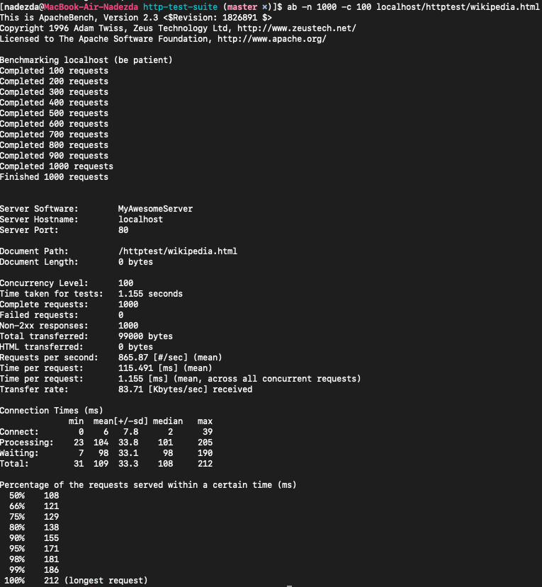
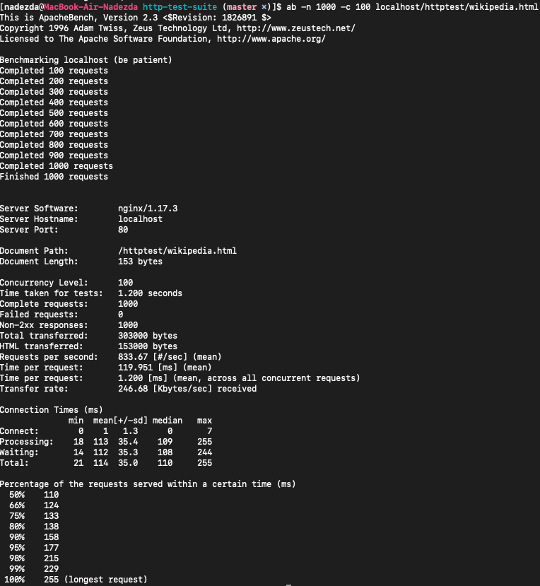

### *python* web-server based on *coroutines*

#### Запуск через докер:

```
docker build -t tp-highload-hw1 .
docker run -p 80:80 -v httpd.conf:/etc/httpd.conf:ro -v /Users/nadezda/Desktop/tp-highload-hw1/http-test-suite:/var/www/html:ro tp-highload-hw1:latest
```

или 

```
./build.sh
```

#### Прогон тестов:
```
cd http-test-suite
python2 httptest.py
```

или просто

```
./http-test-suite/httptest/httptest.py
```
 
 ### Нагрузка через ab:
 
 ```
 ab -n 100000 -c 100 localhost/httptest/wikipedia_russia.html
 ```
 
 ### Мониторинг внутри докера
 
 ```
 docker exec -it *id контейнера* bash
 htop
 top
 ```
 
 ### Запуск nginx для сравнения:
 
 ```
 ./build_nginx.sh
 ```
 
 ### Запуск на тачке:
 
 ```
 ssh -i *unbuntu_id_rsa.pem*
 sudo *все вышеперечисленные программы*
 ```
 
 #### My server RPS:
 
 
 #### Nginx RPS:
 